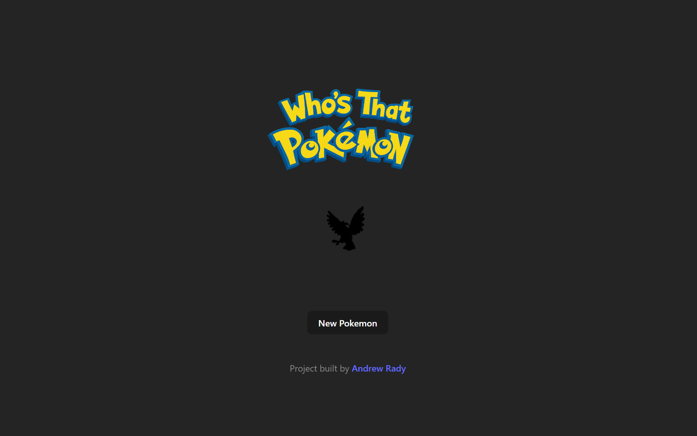
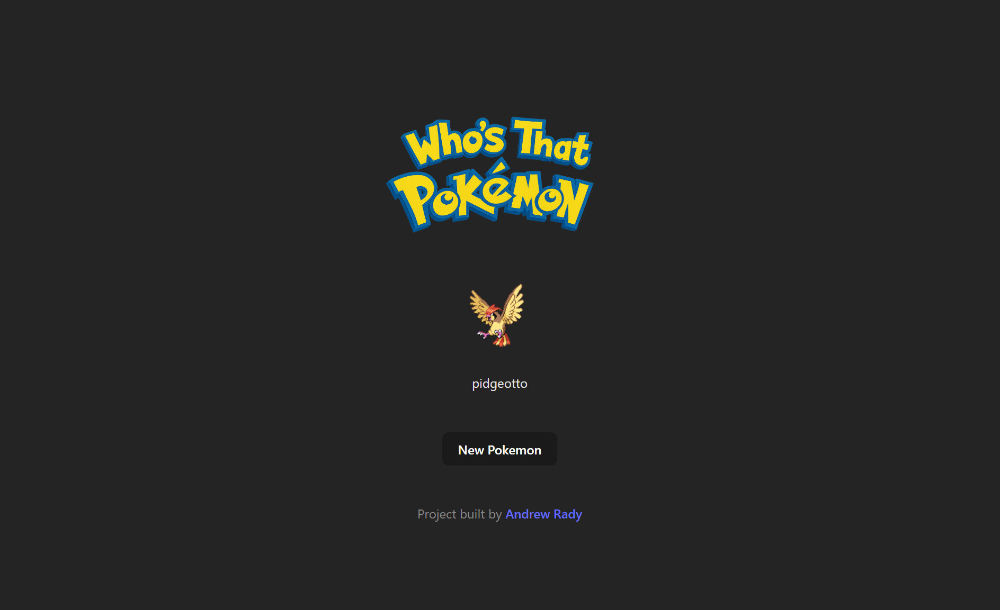

# Who's That Pokémon? 🐱‍👤

A small React + TypeScript side project that fetches random Pokémon from the [PokéAPI](https://pokeapi.co/) and displays them in a "Who's That Pokémon?" style reveal game.

I drew inspiration from a former college [Ryan](https://github.com/mrtrimble) and one of his projects.

[Demo Site](https://magenta-blancmange-b1c35e.netlify.app/)

## Screenshots

### Before

### After


---

## 🚀 Features
- Fetches a random batch of Pokémon from the PokéAPI.
- Shows a random Pokémon silhouette (blacked-out image).
- Click the header to reveal the Pokémon’s name.
- Button to fetch a new random Pokémon.
- Smooth fade and scale animations between states.
- Loading spinner (ClipLoader) with fade transition.

---

## 🛠️ Tech Stack
- **React 18** + **TypeScript**
- **Vite** for bundling
- **Axios** for API calls
- **React Spinners (ClipLoader)** for loading state
- **Custom CSS animations** for reveal effects
- [PokéAPI](https://pokeapi.co/) as the data source

---

## 📦 Installation
Clone the repo and install dependencies:

```bash
git clone https://github.com/your-username/whos-that-pokemon.git
cd whos-that-pokemon
npm install
